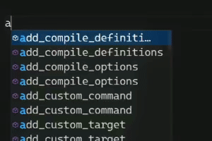

#  **CMake Explicit Glob**

A VSCode extension adding explicit globbing for CMake *(without using file(GLOB ...))* 

   

## How to use...
* Add a #comment with a `@glob()` call above your `add_executable()`, `add_library()`, or `target_sources()`
* Click the `↻ Refresh Glob` code lens above!

```cmake
# @glob("src/**/*.{cpp,c}") 
